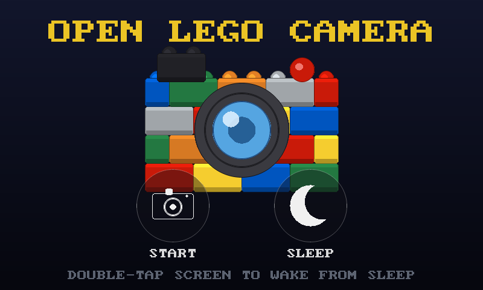

# open-lego-camera-cpp

A touch-friendly, **icon-only** camera app for the **Raspberry Pi Zero 2 W**
(or any Linux box with a webcam), written in **C++17**.

- Works with the **Raspberry Pi camera module** (via libcamera / GStreamer) or
  any **USB webcam** (via V4L2) — auto-detected at startup.
- Runs on a **headless Raspberry Pi** with **no desktop, X11 or Wayland** — it
  draws straight to the **HDMI** output through DRM/KMS (SDL2's `kmsdrm`
  driver, selected automatically).
- Opens on a **welcome screen** with a **camera built from Lego bricks** and two
  big controls: **Start Camera** and **Sleep**. Sleep blanks the screen (and, on
  a Raspberry Pi, powers the panel off via `vcgencmd display_power` to save
  energy on the Zero 2 W); a **double-tap** on the screen wakes it. In the camera
  view a **home** button returns to the welcome screen.
- Fullscreen live preview with a **translucent, auto-hiding menu**: a few
  seconds after your last tap the menu fades away; tap anywhere to bring it
  back.
- Menu buttons are **translucent icons, no text**: gallery, shutter, record.
- **Pinch-to-zoom** with two fingers (digital, up to 4×); the magnification
  factor (e.g. `2.0x`) shows briefly while zooming.
- A **shutter-flash animation** plays when a photo is taken, and the **gallery
  button shows a thumbnail** of the most recent photo/video.
- **Video recording with sound** when a microphone is present (mux via
  `ffmpeg`); disable with `--no-audio`.
- Built-in **gallery**: browse captured photos and videos, **play** videos
  back, and **delete** them behind an icon-only ✓ / ✗ confirmation. The
  capture **date & time** is shown translucent across the top.
- **Battery monitor** for a **UPS HAT** (Waveshare-style, INA219 over I2C): a
  small battery gauge in the **top-right** corner shows the charge level
  (green → amber → red) and a **charging bolt** when it's on power. It reads the
  INA219 directly over `/dev/i2c-*` and **fails soft** — with no HAT fitted (or
  on a plain webcam box) the indicator is simply hidden. Disable it with
  `--no-battery`.
- **WhatsApp-style facial filters** (smiley button): a **Big Smile** that
  stretches your mouth into a wide grin — with your teeth brightening as you
  open it — and a **Crying** face that pulls your mouth and brows into a frown
  and adds animated falling **tears**. The face is *reshaped in place* (its own
  pixels warped), not covered with cartoon graphics — only the tears are drawn
  on top. Applies live to the preview and to captured photos/videos.




> The screenshots above are rendered by the offscreen mockup tools
> (`tools/welcome_mockup.cpp` and `tools/mockup.cpp`) using the exact same UI
> code the app runs.

## How it meets the brief

| Requirement | How |
| --- | --- |
| Welcome screen with a Lego-brick camera; Start / Sleep options | `Mode::Welcome` draws `drawLegoCamera` (bricks + lens in `icons.cpp`); Sleep blanks the panel via `vcgencmd display_power` and wakes on a double-tap |
| Runs with a webcam **or** Pi camera | `Camera` auto-detects: libcamera (GStreamer) first, then V4L2 webcam |
| Written in C++ | C++17, CMake build |
| Translucent, auto-hiding menu | `Menu` fades the icon row out ~3.5 s after the last tap; any tap wakes it |
| Photos, video **with audio**, zoom, gallery, delete | shutter / record / gallery icons; pinch-to-zoom; `arecord`+`ffmpeg` mux audio |
| Icon-only buttons, no text | all icons are drawn as vector shapes (`icons.cpp`, SDL2_gfx) |
| Headless — no X11 / window manager | SDL2 `kmsdrm`/`fbcon` renders directly to HDMI |
| WhatsApp-style facial filters | `FaceFilter` finds the face (Haar cascade) and warps the mouth/brows with `cv::remap`; the crying filter also draws tears (`filters.cpp`) |
| UPS HAT battery monitor | `BatteryMonitor` reads the INA219 over `/dev/i2c-*` and `App::drawBatteryIndicator` renders the top-right gauge (`battery.cpp`) |

## Dependencies

Install the development libraries (names are for Raspberry Pi OS / Debian
Bookworm):

```sh
sudo apt install build-essential cmake pkg-config \
                 libsdl2-dev libsdl2-gfx-dev libopencv-dev
```

Optional, for **video sound**: `ffmpeg` (muxing) and `alsa-utils` (`arecord`):

```sh
sudo apt install ffmpeg alsa-utils
```

The **facial filters** need OpenCV's `objdetect` module (part of `libopencv-dev`
above) and its bundled Haar cascades, which Debian/Raspberry Pi OS ship in the
`opencv-data` package:

```sh
sudo apt install opencv-data
```

If the cascade lives somewhere non-standard, point the app at it with
`--face-cascade /path/to/haarcascade_frontalface_default.xml`. Without a
cascade the app still runs — the facial filters simply stay inactive.

For the **Pi camera module** you also need the libcamera GStreamer element,
which is what lets OpenCV open the camera without a desktop:

```sh
sudo apt install gstreamer1.0-libcamera gstreamer1.0-plugins-good \
                 gstreamer1.0-plugins-base libcamera-tools
```

(A USB webcam needs none of the GStreamer/libcamera packages — it goes
through V4L2 directly.)

### Pi camera notes (including the IMX500 AI camera)

The libcamera GStreamer source is asked for a **processed** pixel format
(`NV12`, then `YUV420`/`RGBx`/`BGRx`/`RGB` as fallbacks). This matters on
sensors like the Sony **IMX500 AI camera**: if the format isn't pinned,
libcamerasrc negotiates the sensor's native Bayer stream
(`2028x1520-SRGGB16/RAW`), which the pipeline can't convert, and it fails to
start. Pinning a processed format avoids that.

#### Preview performance (NV12 → GPU)

The ISP inside the Pi camera already outputs **NV12** (a YUV format), so the
live preview keeps frames in NV12 all the way to the screen and lets the Pi's
**GPU** do the YUV→RGB conversion while it draws — via an `SDL_PIXELFORMAT_NV12`
texture — instead of spending a CPU core on a per-frame `videoconvert`. Pinch
**zoom** is likewise a GPU crop-and-scale (a texture source rect), not a CPU
`resize`. The result is a noticeably smoother, lower-latency preview on the Pi
Zero 2 W, where the CPU colour-convert was the frame-rate bottleneck.

A frame is only converted to BGR on the CPU when something actually needs the
pixels — taking a photo or recording — so the common "just previewing" case
does no colour conversion or resize on the CPU at all.

The **facial filters** stay on that fast path too. Face detection runs directly
on the NV12 **Y (luma) plane** — which _is_ a grayscale image — so it needs no
conversion, and only the **face region** is converted to BGR, reshaped, and
re-encoded back into the NV12 frame. The GPU still converts and zooms the whole
frame, so filtering costs work proportional to the face's size on screen rather
than a full-frame convert every frame. (A USB webcam, which delivers BGR, still
converts the whole frame for filters.)

If the renderer can't sample NV12 textures, or raw NV12 capture won't start, the
app transparently falls back to converting to BGR with libcamera's
`videoconvert` — now spread across **all CPU cores** (`n-threads`) with a
decoupling `queue`, so even the fallback is faster than a single-threaded
convert.

If you have **more than one camera** (e.g. the IMX500 *and* a USB webcam),
`--camera auto` tries the first libcamera camera before falling back to a
webcam. Force a source explicitly with `--camera picam` / `--camera webcam`,
and pick a specific libcamera camera with `--picam-name` — list the ids with:

```sh
rpicam-hello --list-cameras
```

Sanity-check the raw pipeline outside the app with:

```sh
gst-launch-1.0 libcamerasrc ! video/x-raw,format=NV12,width=1280,height=720 \
  ! videoconvert ! autovideosink
```

If that shows a picture, the app will too.

## Build

```sh
cmake -B build -S .
cmake --build build -j
```

The binary is `build/open-lego-camera`.

## Run

```sh
build/open-lego-camera [options]
```

```
  --camera auto|picam|webcam   camera source (default: auto)
  --output-dir DIR             where captures are saved
                               (default: ~/Pictures/open-lego-camera)
  --webcam-index N             force /dev/videoN for a USB webcam
  --size WxH                   requested preview size (default: 1280x720)
  --rotate 0|90|180|270        rotate the whole UI to match a rotated panel
  --touch-rotate 0|90|180|270  extra touch rotation if touch is misaligned
  --touch-flip-x / --touch-flip-y   mirror touch on an axis
  --driver NAME                force SDL video driver (kmsdrm, fbcon, x11)
  --windowed                   run in a window instead of fullscreen
  --no-audio                   record video without sound
  --face-cascade PATH          Haar face-cascade XML for the facial filters
  --i2c-bus N                  I2C bus the UPS HAT is on (default: 1)
  --battery-address ADDR       INA219 I2C address (default: 0x43; use 0x42
                               for the full-size UPS HAT)
  --no-battery                 hide the UPS HAT battery indicator
  --help                       show this help
```

### UPS HAT battery monitor

If you fit a Waveshare-style **UPS HAT** (any board built around a **INA219**
current/voltage monitor, e.g. the Pi-Zero-sized *UPS HAT (C)*), a small battery
gauge appears in the **top-right** corner: it fills from green to red as the
pack drains and shows a **charging bolt** while it's on power.

Enable I2C once on the Pi (`raspi-config` → *Interface Options* → *I2C*, or add
`dtparam=i2c_arm=on` to `/boot/firmware/config.txt`), and make sure your user is
in the `i2c` group so `/dev/i2c-1` is readable. The app tries `0x43` (the
Pi-Zero *UPS HAT (C)*) first and then **auto-probes the other common INA219
addresses `0x40`–`0x45`**, so most boards just work; pass
`--battery-address 0xNN` to force a specific one, or `--i2c-bus N` for a
non-default bus.

The monitor **fails soft**: if the bus or sensor can't be reached (no HAT
fitted, or running on a desktop/webcam box), the app logs one line and hides the
indicator rather than showing fake numbers. Use `--no-battery` to turn it off
outright.

**If the gauge doesn't appear**, check the app's startup log for a line
beginning with `battery:` — it says whether the sensor was found, or points at
the fix (enable I2C, join the `i2c` group, or check wiring with
`i2cdetect -y 1`).

The charge estimate maps a single Li-ion cell's `3.0 V` (empty) → `4.2 V` (full)
onto 0–100 %, reading the INA219's bus-voltage register directly.

### Facial filters

Tap the **smiley** button (bottom-left in the camera view) to cycle the live
facial filter: **Big Smile** → **Crying** → off. The active filter's name
appears briefly on screen, and the effect is baked into any photo or video you
then capture.

- **Big Smile** stretches your mouth's corners up and out into a wide grin and
  opens it vertically; the more you open your mouth, the more your teeth are
  brightened, so they "pop".
- **Crying** curls your mouth down into a frown, pinches your inner brows down,
  and streams animated tears down your cheeks.

Both filters *warp your actual face* — no cartoon mouth or eyes are pasted on
top; only the crying tears are drawn over the image. Faces are found with a
stock OpenCV Haar cascade, so no landmark model or `opencv_contrib` build is
required — keeping it light enough for the Pi Zero 2 W.

### Rotating the display

`--rotate 90|180|270` rotates the **entire UI** — the camera preview *and* the
icon buttons — clockwise to match a panel mounted in a different orientation
(the UI is drawn to an offscreen canvas and blitted rotated, and taps are
un-rotated to match). Use this when the picture and buttons appear sideways:

```sh
build/open-lego-camera --rotate 90
```

`--rotate` also rotates touch input to match, so if the touch panel is aligned
with the display you usually need nothing else. `--touch-rotate` /
`--touch-flip-x` / `--touch-flip-y` are a *separate* correction for when the
touch controller is mounted rotated/mirrored **relative to the panel** (common
on the HyperPixel) — reach for them only if taps are still off after `--rotate`.

- Captures are saved as `IMG_YYYYMMDD_HHMMSS.jpg` and
  `VID_YYYYMMDD_HHMMSS.mp4`.
- The app opens on the **welcome screen**; tap **Start Camera** to begin or
  **Sleep** to blank the screen (**double-tap** to wake). The **home** icon in
  the camera menu returns here.
- **Tap the screen** to wake the menu after it has faded.
- **Esc** or **Q** steps back one screen: camera → welcome, gallery → camera,
  and quits from the welcome screen. Any key wakes the screen from sleep.
- `--windowed` is handy when developing on a desktop (the app then uses the
  desktop's SDL driver automatically).

## Headless HDMI (no desktop)

The app does **not** need a desktop, X11 or Wayland. On a Pi booted to the
plain text console (Raspberry Pi OS Lite, or `raspi-config` → *System Options*
→ *Boot / Auto Login* → *Console*) it draws directly to the HDMI screen via
DRM/KMS.

1. Give your user access to the GPU/DRM and input devices once, then re-login:

   ```sh
   sudo usermod -aG video,render,input "$USER"
   ```

2. Run it **from a console on the Pi itself** (a keyboard/screen on the Pi, or
   the active TTY) — not over SSH. SDL needs the active HDMI console to take
   over the framebuffer:

   ```sh
   build/open-lego-camera
   ```

The driver is auto-selected: a desktop driver when `DISPLAY`/`WAYLAND_DISPLAY`
is set, otherwise `kmsdrm` then `fbcon`. Force one with `--driver kmsdrm` (or
set `SDL_VIDEODRIVER`) if the guess is wrong.

> Running over SSH with no HDMI console attached fails with "could not open a
> display" — that is expected; launch it on the Pi's own console.

### Autostart on boot (optional)

On a headless Pi the app must own the **active HDMI console** to grab the
DRM/KMS framebuffer, so the simplest reliable autostart is console auto-login
plus a launch from the login shell.

1. `raspi-config` → *System Options* → *Boot / Auto Login* → *Console
   Autologin*.
2. Append to `~/.bash_profile`:

   ```sh
   # start the camera on the main HDMI console only
   if [ "$(tty)" = "/dev/tty1" ]; then
     exec "$HOME/open-lego-camera-cpp/build/open-lego-camera"
   fi
   ```

`exec` replaces the login shell with the app; `Esc`/`Q` (or a crash) drops you
back to a login prompt.

## Debugging HDMI / no display

Black screen, or "could not open a display"? The output chain is
**SDL2 → `kmsdrm` → DRM/KMS → HDMI connector**; work down it.

**First, read the app's own startup log.** It now prints what it tried:

```
display: driver 'kmsdrm' up; 1 output(s) detected
  [0] HDMI-A-1 1920x1080
display: kmsdrm 1920x1080
```

- `0 output(s) detected` → the kernel sees **no connected HDMI** with a mode
  (cable/EDID/hotplug). Jump to step 3.
- `CreateWindow failed: ...` → a driver/permission/DRM-master problem. Steps 1–2.
- No `display:` lines at all, or it exits immediately → not a display issue;
  check the camera line above it.

**1. Are you on the console, not SSH?** `kmsdrm` must be **DRM master**, which
means running on the machine's active screen, not a bare SSH shell where the
`getty` on tty1 holds it. Run it on the Pi's own keyboard/console, from tty1, or
as a systemd service on the seat. Quick test from SSH: switch the active VT with
`sudo chvt 1` first, or just `sudo build/open-lego-camera`.

**2. Permissions / contention.**
```sh
groups                      # need: video, render, input
sudo usermod -aG video,render,input "$USER"   # then re-login
```
If a desktop (X/Wayland) or another instance is running it will own DRM master
and `CreateWindow` fails — boot to console (`raspi-config` → *System Options* →
*Boot / Auto Login* → *Console*) or stop the desktop.

**3. Does the kernel even see the HDMI connector?**
```sh
ls /dev/dri/                                   # expect card0/card1 + renderD128
for s in /sys/class/drm/*/status; do echo "$s = $(cat "$s")"; done
```
Look for a line like `card1-HDMI-A-1/status = connected`. If it says
`disconnected` while a monitor is plugged in, it's a hotplug/EDID issue — in
`/boot/firmware/config.txt`:
```ini
hdmi_force_hotplug=1
# if still blank, pin a known-good mode (1080p60):
hdmi_group=1
hdmi_mode=16
```
(These `hdmi_*` keys apply to the legacy path; on KMS you can instead force a
mode with a kernel arg in `cmdline.txt`, e.g. `video=HDMI-A-1:1920x1080@60`.)

**4. Is KMS actually enabled?** `kmsdrm` needs the full KMS driver:
```ini
# /boot/firmware/config.txt
dtoverlay=vc4-kms-v3d
```
Check it loaded: `dmesg | grep -i "drm\|vc4"`.

**5. Prove the pipe independent of this app.** Draw a KMS test pattern straight
to the connector (no SDL, no app):
```sh
sudo apt install libdrm-tests   # provides modetest
modetest -M vc4 -c              # list connectors + modes
sudo modetest -M vc4 -s <connector_id>:<mode>   # e.g. -s 32:1920x1080
```
If `modetest` shows nothing either, the problem is entirely system-level
(config.txt / cable / KMS), not the app. If `modetest` works but the app is
black, tell me and we'll dig into SDL.

**6. HDMI + HyperPixel together.** With the HyperPixel DPI overlay enabled there
are two connectors; `kmsdrm` renders to the **first connected** one, which may
be the DPI panel, leaving HDMI dark (or vice-versa). To test HDMI alone,
comment out the `dtoverlay=vc4-kms-dpi-hyperpixel4` line and reboot. To pick one
deliberately, force it in `cmdline.txt` with `video=HDMI-A-1:1920x1080@60`
(and/or disable the other connector).

## Pimoroni HyperPixel 4.0 (DPI touchscreen)

The HyperPixel 4.0" rectangular is an **800×480 DPI panel** (parallel RGB over
the GPIO header) with an **I²C capacitive touch** controller — not HDMI and not
DSI. On a current Raspberry Pi OS (Bookworm, `vc4-kms-v3d`) it comes up as a
normal **DRM/KMS** output, so this app drives it through the same `kmsdrm` path
— you just need to enable the panel and align the touch.

### 1. Enable the panel

Add the HyperPixel4 KMS overlay to `/boot/firmware/config.txt` (make sure the
KMS driver is active and the panel isn't fighting HDMI for the console):

```ini
# Full KMS (usually already present)
dtoverlay=vc4-kms-v3d

# HyperPixel 4.0 rectangular. (Square panel: vc4-kms-dpi-hyperpixel4sq)
dtoverlay=vc4-kms-dpi-hyperpixel4
```

Then reboot and confirm the overlay is actually installed and the panel is a
DRM connector:

```sh
ls /boot/firmware/overlays | grep -i hyperpixel   # overlay present?
```

If your OS image doesn't ship the overlay, install Pimoroni's driver first,
which adds the overlay and the touch setup, then reboot:

```sh
git clone https://github.com/pimoroni/hyperpixel4
cd hyperpixel4 && sudo ./install.sh
```

> **HDMI + HyperPixel together:** SDL's `kmsdrm` renders to the first connected
> connector, which may be HDMI. For a HyperPixel-only setup, leave HDMI
> unplugged (or force the connector with a `video=` kernel arg). The console
> should appear on the HyperPixel once the overlay is active.

### 2. Run it

It's a KMS output, so nothing special is needed — the driver auto-selects
`kmsdrm`:

```sh
build/open-lego-camera            # add --driver kmsdrm to force it
```

The UI is fullscreen and adapts to the panel's 800×480 automatically. If the
preview and buttons come up **sideways** for how the panel is mounted, rotate
the whole UI with `--rotate` (see [Rotating the display](#rotating-the-display)):

```sh
build/open-lego-camera --rotate 90    # try 90/180/270
```

### 3. Align the touch

The HyperPixel's touch controller is commonly **rotated/mirrored** relative to
the panel, so a tap may land in the wrong place. Correct it entirely in the app
— no X11/libinput calibration needed — with:

```sh
build/open-lego-camera --touch-rotate 90                 # try 0/90/180/270
build/open-lego-camera --touch-rotate 90 --touch-flip-x  # add flips if needed
```

Find the right combination by tapping the shutter (bottom row) and watching
where the press registers: pick the `--touch-rotate` that makes vertical taps
track vertically, then add `--touch-flip-x`/`--touch-flip-y` if an axis is
mirrored. If you rotate the **display** via the overlay (a `rotate=` parameter),
match `--touch-rotate` to it. Once found, bake the flags into your autostart
line.

## Menu icons

| Icon | Action |
| --- | --- |
| camera (welcome) | start the live camera |
| crescent moon (welcome) | sleep — blank the screen; double-tap to wake |
| house (camera) | back to the welcome screen |
| last-shot thumbnail (framed-landscape icon until the first capture) | open the gallery |
| ring with dot | take a photo (plays a shutter flash) |
| red dot → red square | start recording → stop (turns into a stop square) |
| chevron (gallery) | back to the camera |
| ◀ / ▶ triangles (gallery) | previous / next item |
| triangle-in-ring (gallery) | play the selected video |
| trash can (gallery) | delete the shown item (asks ✓ / ✗) |
| ✓ green / ✗ red | confirm / cancel a delete |

**Zoom** is not a button: **pinch with two fingers** on the preview to zoom
(digital, up to 4×). The current factor (`1.0x`–`4.0x`) appears briefly at the
top while you pinch.

## Audio

Videos are recorded **with sound** when a microphone is present (the Pi camera
module has none — plug in a USB mic or a webcam with one):

- Frames are written by OpenCV's `VideoWriter` (`mp4v`) to a temp file while
  `arecord` captures a WAV from the default ALSA input.
- On stop, the two are muxed into the final `.mp4` in the background with
  `ffmpeg -c:v copy -c:a aac`.
- If a mic, `arecord` or `ffmpeg` is missing, recording silently falls back to
  **video-only**. `--no-audio` forces this.

## Design notes

- **Modules** (`src/`): `camera` (dual backend + digital zoom), `recorder`
  (video + audio muxing), `gallery` (list/navigate/delete), `icons`
  (procedural vector icons), `ui` (auto-hide menu, layout, hit-testing), `app`
  (SDL display, event loop, per-mode rendering), `config` (CLI).
- **Zoom** is a uniform centre-crop-and-rescale applied to both preview and
  captures, so behaviour is identical on the Pi camera and a webcam.
- **Rendering**: each BGR frame is uploaded to a streaming SDL texture and
  letterboxed to the screen; the translucent menu is composited on top with
  alpha blending.
- Video **playback** decodes frames with OpenCV — no external player needed;
  tap anywhere to stop.

## Preview the UI without a Pi

`tools/mockup.cpp` renders every menu state to `build/ui-mockup.png` using the
real UI code (handy for tweaking icons on a desktop):

```sh
g++ -std=c++17 tools/mockup.cpp src/ui.cpp src/icons.cpp -o build/mockup \
    $(pkg-config --cflags --libs sdl2 SDL2_gfx opencv4)
./build/mockup
```

## License

MIT — see [LICENSE](LICENSE).
