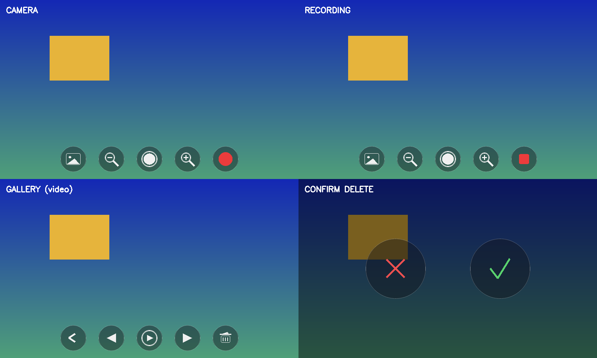

# open-lego-camera-cpp

A touch-friendly, **icon-only** camera app for the **Raspberry Pi Zero 2 W**
(or any Linux box with a webcam), written in **C++17**.

- Works with the **Raspberry Pi camera module** (via libcamera / GStreamer) or
  any **USB webcam** (via V4L2) — auto-detected at startup.
- Runs on a **headless Raspberry Pi** with **no desktop, X11 or Wayland** — it
  draws straight to the **HDMI** output through DRM/KMS (SDL2's `kmsdrm`
  driver, selected automatically).
- Fullscreen live preview with a **translucent, auto-hiding menu**: a few
  seconds after your last tap the menu fades away; tap anywhere to bring it
  back.
- Menu buttons are **translucent icons, no text**: gallery, zoom out, shutter,
  zoom in, record.
- **Video recording with sound** when a microphone is present (mux via
  `ffmpeg`); disable with `--no-audio`.
- Built-in **gallery**: browse captured photos and videos, **play** videos
  back, and **delete** them behind an icon-only ✓ / ✗ confirmation.



> The screenshot above is rendered by the offscreen mockup tool
> (`tools/mockup.cpp`) using the exact same UI code the app runs.

## How it meets the brief

| Requirement | How |
| --- | --- |
| Runs with a webcam **or** Pi camera | `Camera` auto-detects: libcamera (GStreamer) first, then V4L2 webcam |
| Written in C++ | C++17, CMake build |
| Translucent, auto-hiding menu | `Menu` fades the icon row out ~3.5 s after the last tap; any tap wakes it |
| Photos, video **with audio**, zoom, gallery, delete | shutter / record / zoom± / gallery icons; `arecord`+`ffmpeg` mux audio |
| Icon-only buttons, no text | all icons are drawn as vector shapes (`icons.cpp`, SDL2_gfx) |
| Headless — no X11 / window manager | SDL2 `kmsdrm`/`fbcon` renders directly to HDMI |

## Dependencies

Install the development libraries (names are for Raspberry Pi OS / Debian
Bookworm):

```sh
sudo apt install build-essential cmake pkg-config \
                 libsdl2-dev libsdl2-gfx-dev libopencv-dev
```

Optional, for **video sound**: `ffmpeg` (muxing) and `alsa-utils` (`arecord`):

```sh
sudo apt install ffmpeg alsa-utils
```

For the **Pi camera module** you also need the libcamera GStreamer element,
which is what lets OpenCV open the camera without a desktop:

```sh
sudo apt install gstreamer1.0-libcamera gstreamer1.0-plugins-good \
                 gstreamer1.0-plugins-base libcamera-tools
```

(A USB webcam needs none of the GStreamer/libcamera packages — it goes
through V4L2 directly.)

### Pi camera notes (including the IMX500 AI camera)

The libcamera GStreamer source is asked for a **processed** pixel format
(`NV12`, then `YUV420`/`RGBx`/`BGRx`/`RGB` as fallbacks). This matters on
sensors like the Sony **IMX500 AI camera**: if the format isn't pinned,
libcamerasrc negotiates the sensor's native Bayer stream
(`2028x1520-SRGGB16/RAW`), which the pipeline can't convert, and it fails to
start. Pinning a processed format avoids that.

If you have **more than one camera** (e.g. the IMX500 *and* a USB webcam),
`--camera auto` tries the first libcamera camera before falling back to a
webcam. Force a source explicitly with `--camera picam` / `--camera webcam`,
and pick a specific libcamera camera with `--picam-name` — list the ids with:

```sh
rpicam-hello --list-cameras
```

Sanity-check the raw pipeline outside the app with:

```sh
gst-launch-1.0 libcamerasrc ! video/x-raw,format=NV12,width=1280,height=720 \
  ! videoconvert ! autovideosink
```

If that shows a picture, the app will too.

## Build

```sh
cmake -B build -S .
cmake --build build -j
```

The binary is `build/open-lego-camera`.

## Run

```sh
build/open-lego-camera [options]
```

```
  --camera auto|picam|webcam   camera source (default: auto)
  --output-dir DIR             where captures are saved
                               (default: ~/Pictures/open-lego-camera)
  --webcam-index N             force /dev/videoN for a USB webcam
  --size WxH                   requested preview size (default: 1280x720)
  --driver NAME                force SDL video driver (kmsdrm, fbcon, x11)
  --windowed                   run in a window instead of fullscreen
  --no-audio                   record video without sound
  --help                       show this help
```

- Captures are saved as `IMG_YYYYMMDD_HHMMSS.jpg` and
  `VID_YYYYMMDD_HHMMSS.mp4`.
- **Tap the screen** to wake the menu after it has faded.
- **Esc** or **Q** quits (from the camera view); in the gallery they step back
  to the preview.
- `--windowed` is handy when developing on a desktop (the app then uses the
  desktop's SDL driver automatically).

## Headless HDMI (no desktop)

The app does **not** need a desktop, X11 or Wayland. On a Pi booted to the
plain text console (Raspberry Pi OS Lite, or `raspi-config` → *System Options*
→ *Boot / Auto Login* → *Console*) it draws directly to the HDMI screen via
DRM/KMS.

1. Give your user access to the GPU/DRM and input devices once, then re-login:

   ```sh
   sudo usermod -aG video,render,input "$USER"
   ```

2. Run it **from a console on the Pi itself** (a keyboard/screen on the Pi, or
   the active TTY) — not over SSH. SDL needs the active HDMI console to take
   over the framebuffer:

   ```sh
   build/open-lego-camera
   ```

The driver is auto-selected: a desktop driver when `DISPLAY`/`WAYLAND_DISPLAY`
is set, otherwise `kmsdrm` then `fbcon`. Force one with `--driver kmsdrm` (or
set `SDL_VIDEODRIVER`) if the guess is wrong.

> Running over SSH with no HDMI console attached fails with "could not open a
> display" — that is expected; launch it on the Pi's own console.

### Autostart on boot (optional)

On a headless Pi the app must own the **active HDMI console** to grab the
DRM/KMS framebuffer, so the simplest reliable autostart is console auto-login
plus a launch from the login shell.

1. `raspi-config` → *System Options* → *Boot / Auto Login* → *Console
   Autologin*.
2. Append to `~/.bash_profile`:

   ```sh
   # start the camera on the main HDMI console only
   if [ "$(tty)" = "/dev/tty1" ]; then
     exec "$HOME/open-lego-camera-cpp/build/open-lego-camera"
   fi
   ```

`exec` replaces the login shell with the app; `Esc`/`Q` (or a crash) drops you
back to a login prompt.

## Menu icons

| Icon | Action |
| --- | --- |
| framed landscape | open the gallery |
| magnifier − / + | zoom out / in (digital, up to 4×) |
| ring with dot | take a photo |
| red dot → red square | start recording → stop (turns into a stop square) |
| chevron (gallery) | back to the camera |
| ◀ / ▶ triangles (gallery) | previous / next item |
| triangle-in-ring (gallery) | play the selected video |
| trash can (gallery) | delete the shown item (asks ✓ / ✗) |
| ✓ green / ✗ red | confirm / cancel a delete |

## Audio

Videos are recorded **with sound** when a microphone is present (the Pi camera
module has none — plug in a USB mic or a webcam with one):

- Frames are written by OpenCV's `VideoWriter` (`mp4v`) to a temp file while
  `arecord` captures a WAV from the default ALSA input.
- On stop, the two are muxed into the final `.mp4` in the background with
  `ffmpeg -c:v copy -c:a aac`.
- If a mic, `arecord` or `ffmpeg` is missing, recording silently falls back to
  **video-only**. `--no-audio` forces this.

## Design notes

- **Modules** (`src/`): `camera` (dual backend + digital zoom), `recorder`
  (video + audio muxing), `gallery` (list/navigate/delete), `icons`
  (procedural vector icons), `ui` (auto-hide menu, layout, hit-testing), `app`
  (SDL display, event loop, per-mode rendering), `config` (CLI).
- **Zoom** is a uniform centre-crop-and-rescale applied to both preview and
  captures, so behaviour is identical on the Pi camera and a webcam.
- **Rendering**: each BGR frame is uploaded to a streaming SDL texture and
  letterboxed to the screen; the translucent menu is composited on top with
  alpha blending.
- Video **playback** decodes frames with OpenCV — no external player needed;
  tap anywhere to stop.

## Preview the UI without a Pi

`tools/mockup.cpp` renders every menu state to `build/ui-mockup.png` using the
real UI code (handy for tweaking icons on a desktop):

```sh
g++ -std=c++17 tools/mockup.cpp src/ui.cpp src/icons.cpp -o build/mockup \
    $(pkg-config --cflags --libs sdl2 SDL2_gfx opencv4)
./build/mockup
```

## License

MIT — see [LICENSE](LICENSE).
